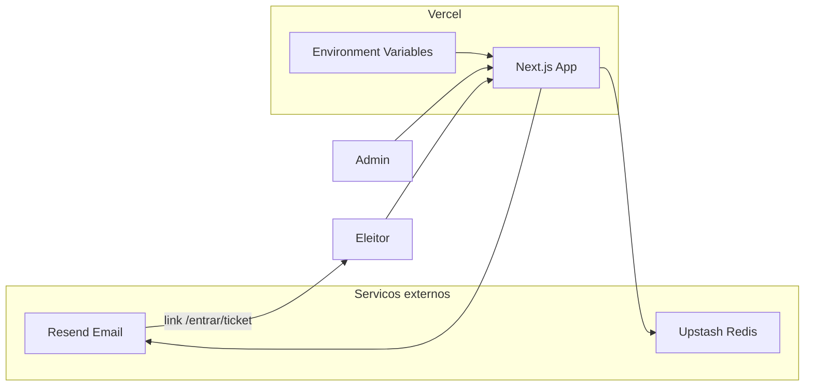

# Deploy do Concilio na Vercel

Guia passo a passo para publicar o sistema de votação anônima em produção.

## Visão geral

O Concilio é uma aplicação **Next.js** que depende de:

| Serviço | Função |
|---------|--------|
| **Upstash Redis** | Eleições, votos, sessões admin, tickets de voto (TTL) |
| **Resend** | E-mail com link de votação e resultados ao encerrar |
| **Vercel** | Hospedagem, build e variáveis de ambiente |



**Importante:** o arquivo `src/lib/env.ts` valida todas as variáveis durante o `next build`. Se alguma estiver ausente ou inválida na Vercel, o deploy falha com erro `ZodError`.

---

## Pré-requisitos

- Conta em [GitHub](https://github.com)
- Conta em [Vercel](https://vercel.com)
- Conta em [Upstash](https://console.upstash.com)
- Conta em [Resend](https://resend.com)
- Git instalado na máquina local

---

## Passo 1 — Validar o build localmente

Na pasta do projeto:

```bash
npm install
npm run typecheck
npm run build
```

Se o build falhar localmente, corrija antes de subir para a Vercel. Use um `.env` preenchido (copie de `.env.example`).

---

## Passo 2 — Configurar Upstash Redis

1. Acesse [console.upstash.com](https://console.upstash.com).
2. **Create database** — escolha região próxima (ex.: `sa-east-1` ou `us-east-1`).
3. Na aba do banco, copie:
   - **UPSTASH_REDIS_REST_URL**
   - **UPSTASH_REDIS_REST_TOKEN**

Não use os placeholders do `.env.example` (`your-instance.upstash.io`).

### Integração opcional na Vercel

No projeto Vercel: **Storage → Create → Upstash Redis**. Isso pode preencher automaticamente `UPSTASH_REDIS_REST_URL` e `UPSTASH_REDIS_REST_TOKEN`.

---

## Passo 3 — Configurar Resend

1. Acesse [resend.com](https://resend.com) → **API Keys** → crie uma chave (`re_...`).
2. Para **desenvolvimento**, use:
   ```env
   EMAIL_FROM="Concilio <onboarding@resend.dev>"
   ```
   O tier gratuito só envia para o e-mail da sua conta Resend.
3. Para **produção** (eleitores reais):
   - Vá em **Domains** → adicione seu domínio (ex.: `votacao.suaigreja.org.br`).
   - Configure os registros DNS indicados pelo Resend.
   - Após verificação, use:
     ```env
     EMAIL_FROM="Concilio <noreply@votacao.suaigreja.org.br>"
     ```

Sem domínio verificado, os links de votação **não chegam** para e-mails arbitrários.

---

## Passo 4 — Gerar segredos

Gere **três valores diferentes** (mínimo 24 caracteres cada):

**PowerShell (Windows):**

```powershell
[Convert]::ToBase64String((1..32 | ForEach-Object { Get-Random -Maximum 256 }))
```

Execute três vezes e use em `AUTH_SECRET`, `CODE_HASH_SECRET` e `CSRF_SECRET`.

**OpenSSL (se disponível):**

```bash
openssl rand -base64 32
```

---

## Passo 5 — Enviar código para o GitHub

Na pasta do projeto:

```bash
git init
git add .
git commit -m "Preparar Concilio para deploy"
```

1. No GitHub, crie um repositório **vazio** (ex.: `concilio-votacao`).
2. Conecte e envie:

```bash
git remote add origin https://github.com/SEU_USUARIO/concilio-votacao.git
git branch -M main
git push -u origin main
```

**Nunca** commite o arquivo `.env` — ele já está no `.gitignore`.

---

## Passo 6 — Variáveis de ambiente na Vercel

**O `.env` local não vai para o GitHub.** Copie os valores dele para a Vercel. Guia visual: **[VERCEL_VARIAVEIS.md](VERCEL_VARIAVEIS.md)**.

1. [vercel.com](https://vercel.com) → seu projeto.
2. **Settings → Environment Variables**.
3. Adicione cada variável do seu `.env` local (valor **sem aspas**).
4. Em **cada** variável, marque **Production** — se marcar só Development, o build falha.
5. Depois de salvar todas, faça **Redeploy** (Deployments → ⋮ → Redeploy).

Na importação de um projeto novo, você também pode colar as variáveis antes do primeiro deploy:

| Variável | Exemplo / notas |
|----------|-----------------|
| `UPSTASH_REDIS_REST_URL` | `https://xxxx.upstash.io` |
| `UPSTASH_REDIS_REST_TOKEN` | token do Upstash |
| `RESEND_API_KEY` | `re_...` |
| `EMAIL_FROM` | E-mail com domínio verificado no Resend |
| `APP_URL` | `https://seu-projeto.vercel.app` (sem `/` no final) |
| `AUTH_SECRET` | segredo longo (único) |
| `CODE_HASH_SECRET` | outro segredo longo |
| `CSRF_SECRET` | terceiro segredo longo |
| `SEED_ADMIN_LOGIN` | ex.: `admin` — **obrigatório** na 1ª vez |
| `SEED_ADMIN_PASSWORD` | ex.: senha forte (mín. 6 caracteres) — **obrigatório** na 1ª vez |

Marque **Production** (e **Preview** se quiser testar branches).

**Atenção:** se `SEED_ADMIN_PASSWORD` (ou qualquer variável da tabela) não estiver na Vercel, o deploy falha no build com erro `invalid_type` / `expected string, received undefined`.

### O que NÃO definir em produção

| Variável | Motivo |
|----------|--------|
| `USE_DEV_MEMORY_STORE` | Dados voláteis; votos se perdem entre instâncias |

`NODE_ENV` é definido automaticamente como `production` na Vercel.

### `APP_URL` — ordem recomendada

1. No primeiro deploy, use uma URL válida. Se ainda não souber a URL final, use um placeholder temporário **somente** se o build exigir (ex.: URL que a Vercel vai gerar após o deploy).
2. Após o deploy bem-sucedido, copie a URL real (ex.: `https://concilio-xyz.vercel.app`).
3. Atualize `APP_URL` em **Settings → Environment Variables**.
4. **Redeploy:** Deployments → ⋮ no último deploy → **Redeploy**.

Os links nos e-mails usam `APP_URL/entrar/[ticket]`. Se `APP_URL` estiver errado, o eleitor recebe link quebrado.

---

## Passo 7 — Fazer o deploy

Na tela de importação do projeto:

| Campo | Valor |
|-------|-------|
| Framework Preset | Next.js (automático) |
| Root Directory | `.` |
| Build Command | `npm run build` |
| Install Command | `npm install` |
| Output Directory | (padrão Next.js) |

Clique **Deploy** e acompanhe os logs.

### Erros comuns no build

| Sintoma | Causa provável | Solução |
|---------|----------------|---------|
| `ZodError` / `SEED_ADMIN_PASSWORD` undefined | Variável ausente na Vercel | Adicione **todas** as vars da tabela; marque **Production**; **Redeploy** |
| `ZodError` em `env.ts` | Variável ausente ou formato inválido | Revise todas as vars da tabela acima |
| `EMAIL_FROM` inválido | Formato sem `<email@dominio>` | Use `Nome <email@dominio.com>` |
| `APP_URL` inválido | Sem `https://` ou com barra final | Use `https://dominio.com` sem `/` no fim |

---

## Passo 8 — Domínio próprio (opcional)

1. Vercel → projeto → **Settings → Domains**.
2. Adicione `votacao.seudominio.com`.
3. Configure o CNAME no seu provedor DNS conforme instruções da Vercel.
4. Atualize `APP_URL` para `https://votacao.seudominio.com`.
5. Redeploy.
6. No Resend, use o mesmo domínio em `EMAIL_FROM`.

---

## Passo 9 — Testes pós-deploy

| # | Teste | Resultado esperado |
|---|-------|-------------------|
| 1 | Abrir `/` | Formulário CPF + e-mail |
| 2 | `/admin/sair` | Encerra sessão e redireciona ao login |
| 3 | Login em `/admin/login` | Acesso ao painel |
| 4 | Criar eleição e candidatos | Dados persistem (Upstash) |
| 5 | Solicitar link de voto | E-mail recebido (verifique spam) |
| 6 | Clicar link `/entrar/...` | Abre cédula em `/votar` |
| 7 | Registrar voto | Confirmação em `/sucesso` |
| 8 | Encerrar eleição | Resultados por e-mail + export PDF no admin |
| 9 | **Conta do administrador** | Trocar senha padrão imediatamente |

Logs em tempo real: Vercel → projeto → **Logs**.

---

## Conta administrador na primeira execução

- Se o Redis estiver vazio, o sistema cria a conta admin com `SEED_ADMIN_LOGIN` e `SEED_ADMIN_PASSWORD`.
- Depois disso, alterações no painel (**Conta do administrador**) sobrescrevem o seed.
- **Em produção:** não use `admin@@` — defina senha forte em `SEED_ADMIN_PASSWORD` e troque no painel após o primeiro login.

---

## Operação segura em produção

- Não defina `USE_DEV_MEMORY_STORE` na Vercel.
- Não commite `.env` nem chaves no GitHub.
- Use domínio verificado no Resend para eleitores reais.
- Evite acompanhar resultados em tempo real durante votações muito pequenas (risco de dedução).
- Exporte apenas totais agregados e feedbacks anônimos (PDF no painel).

---

## Checklist rápido

- [ ] Upstash criado; URL e token copiados
- [ ] Resend com API key; domínio verificado (produção)
- [ ] Três segredos gerados (`AUTH_*`, `CODE_*`, `CSRF_*`)
- [ ] Código no GitHub (sem `.env`)
- [ ] Todas as variáveis na Vercel antes do deploy
- [ ] `npm run build` passou localmente
- [ ] Deploy concluído
- [ ] `APP_URL` atualizado com URL final + redeploy
- [ ] Fluxo CPF → e-mail → voto testado
- [ ] Senha admin alterada no painel

---

## Referência

- Variáveis detalhadas: [`.env.example`](../.env.example)
- Configuração local: [`README.md`](../README.md)
